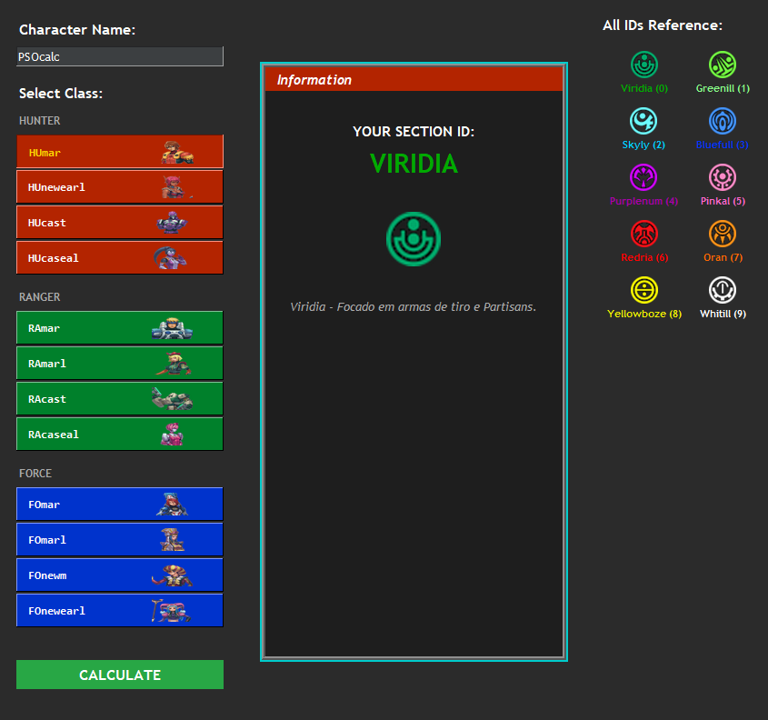

# 🛠️ PSO:BB Section ID Calculator (Ephinea)

Uma calculadora de **Section ID** para *Phantasy Star Online: Blue Burst* (Servidor Ephinea), desenvolvida em Python e Tkinter. O visual foi projetado para simular a interface clássica do jogo original retrô.

 <!-- Tire um print da sua aplicação e salve como screenshot.png na pasta -->

## 🚀 Funcionalidades
- Lógica oficial de cálculo baseada na soma ASCII do nome + offset da classe (módulo 10).
- Cores e miniaturas das 12 classes originais.
- Tabela de referência rápida de todos os Section IDs.
- Suporte a cálculo ao pressionar a tecla `Enter`.

## 📥 Como Baixar e Executar
Não precisa ter o Python instalado!
1. Vá até a aba [Releases](../../releases) aqui no GitHub.
2. Baixe o arquivo `.zip` da versão mais recente.
3. Extraia o conteúdo e execute o `PSO_Calculator.exe`.

> ⚠️ **Importante:** Mantenha o arquivo `.exe` no mesmo diretório das pastas `icons/` e `classes/`.

## 💻 Como Rodar o Código-Fonte
Se você deseja modificar o código, precisará do Python instalado:

1. Clone o repositório:
   ```bash
   git clone https://github.com/robertotajra7/Section-ID-Calculator-PSO-BB.git